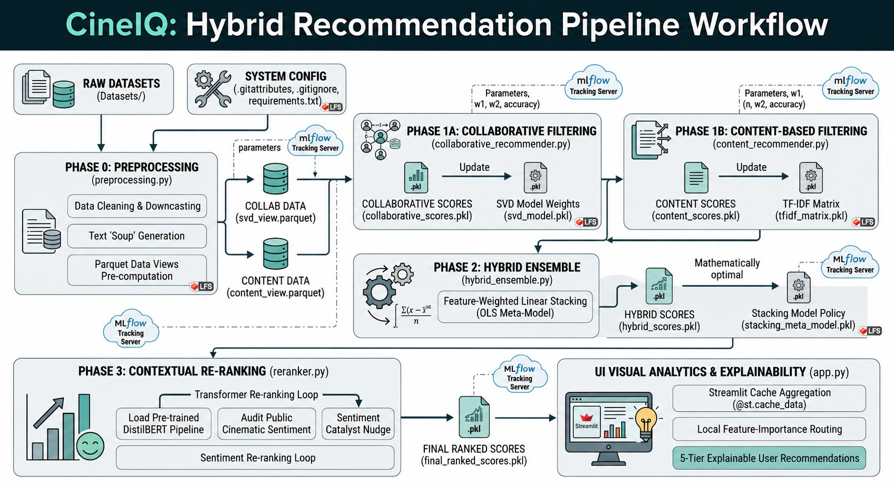

#  CineIQ: Enterprise-Grade Hybrid Recommendation Engine

CineIQ is an enterprise-grade, multi-stage hybrid recommendation pipeline built to handle large scale movie and interaction datasets within localized consumer hardware constraints (16GB RAM / GTX 1660 Ti). The core architecture shifts seamlessly from raw vector parsing to an optimized machine learning ensemble and a contextual transformer re-ranking stage.



## Architectural Summary
The pipeline transitions through 5 modular phases as a complete end-to-end recommendation workflow:
1. **Phase 0: Data Preprocessing (preprocessing.py):** Ingests raw datasets to execute memory-optimized data cleaning and downcasting. Handles text "soup" generation and exports serialized, highly structured Parquet data views (svd_view.parquet and content_view.parquet) to minimize runtime overhead.
2. **Phase 1A: Collaborative Filtering (collaborative_recommender.py):** A behavioral modeling track utilizing SVD Matrix Factorization via the Surprise library to evaluate historical interaction patterns and map candidate predictions to collaborative_scores.pkl.
2. **Phase 1B: Content-Based Filtering (content_recommender.py):** A high-dimensional metadata modeling track implementing TF-IDF Text Vectorization and Linear Kernel Similarity calculations on movie profile configurations to generate independent candidate payloads at content_scores.pkl.
3. **Phase 2: Weighted Stacking Ensemble (hybrid_ensemble.py):** Aggregates the candidate vectors through a Union & Deduplication checkpoint before training an Ordinary Least Squares (OLS) Linear Regression meta-model. This optimization loop learns exact mathematical coefficients ($w_1, w_2$) and the intercept to establish a balanced hybrid policy saved at hybrid_scores.pkl.
4. **Phase 3: Contextual Sentiment Re-Ranking (reranker.py):** A secondary NLP auditing layer that runs deep transformer inference using a pre-trained DistilBERT pipeline (benchmarked against a 50K row IMDB baseline) to audit public cinematic reception, applying a sentiment catalyst nudge to output the definitive target file at final_ranked_scores.pkl.
5. **Phase 4: Explainable Visual Analytics (app.py):** A production-tier Streamlit deployment running a local 5-Tier Explainability Routing Engine. Leverages front-end cache aggregation (@st.cache_data) and forced garbage collection (gc.collect()) to handle dashboard data lookups under hardware limits.

## Tech Stack
- **Language:** Python
- **Data Engineering:** Pandas, NumPy, PyArrow, FastParquet
- **Machine Learning (Collaborative & Content):** Scikit-Learn, Scikit-Surprise
- **Deep Learning (NLP & Sentiment):** PyTorch, Hugging Face Transformers, NLTK
- **MLOps & Tracking:** MLflow
- **Frontend & Visual Analytics:** Streamlit, Plotly

## Dependencies
The primary dependencies powering CineIQ are isolated in `requirements.txt`:
- `numpy==1.26.4`
- `pandas==2.3.3`
- `pyarrow==24.0.0`
- `fastparquet==2026.5.0`
- `scikit-surprise==1.1.4`
- `scikit-learn==1.7.2`
- `scipy==1.15.3`
- `nltk==3.9.4`
- `torch==2.5.1+cu121`
- `transformers==5.8.1`
- `streamlit==1.57.0`
- `plotly==6.7.0`

## Workspace Directory Structure

```text
CineIQ/
├── datasets/                            # [Tracked via Git LFS]
│   ├── imdb.csv                         # Validation set (50K reviews) for sentiment benchmarking
│   ├── movie25lens/
│   │   ├── genome-scores.csv            # Tag relevance scores for movies
│   │   ├── genome-tags.csv              # Tag descriptions for the genome scores
│   │   ├── links.csv                    # Identifiers linking MovieLens to IMDB/TMDB
│   │   ├── movies.csv                   # Raw MovieLens database mapping IDs to human-readable titles/genres
│   │   ├── ratings.csv                  # 25 million user-movie rating interactions
│   │   └── tags.csv                     # User-generated tags for movies
│   └── tmdb/
│       ├── credits.csv                  # Cast and crew information for movies
│       ├── keywords.csv                 # Plot keywords and descriptive tags
│       ├── links.csv                    # Movie identifiers mapping to IMDB
│       └── movies_metadata.csv          # Comprehensive TMDB movie metadata (revenue, overview, etc.)
├── models/                              # [Tracked via Git LFS] 
│   ├── stacking_meta_model.pkl          # OLS Linear Regression coefficients (Generated by hybrid_ensemble.py)
│   ├── svd_model.pkl                    # Serialized Surprise Matrix Factorization weights (Generated by collaborative_recommender.py)
│   ├── tfidf_matrix.pkl                 # Precomputed sparse matrix of movie text vectors (Generated by content_recommender.py)
│   └── tfidf_vectorizer.pkl             # Trained TF-IDF vocabulary schema (Generated by content_recommender.py)
├── mlruns/                              # Local MLflow artifact storage for experiments and models
├── processed/                           # [Tracked via Git LFS] 
│   ├── collaborative_scores.pkl         # SVD candidate prediction dictionaries (Generated by collaborative_recommender.py)
│   ├── content_scores.pkl               # Cosine similarity candidate dictionaries (Generated by content_recommender.py)
│   ├── content_view.parquet             # Memory-optimized textual "soup" profiles (Generated by preprocessing.py)
│   ├── dashboard_view.parquet           # Flattened historical watch profiles for UI (Generated by preprocessing.py)
│   ├── final_ranked_scores.pkl          # Definitive recommendation payload (Generated by reranker.py)
│   ├── hybrid_scores.pkl                # Pre-sentiment stacked ensemble candidate scores (Generated by hybrid_ensemble.py)
│   └── svd_view.parquet                 # Downcasted [userId, movieId, rating] matrix (Generated by preprocessing.py)
├── .gitattributes                       # Git LFS configuration for tracking heavy files (.csv, .pkl, .parquet)
├── .gitignore                           # Prevents tracking of local runtime caches (like __pycache__, .pytest_cache, or .DS_Store)
├── mlflow.db                            # SQLite database backend for local MLflow tracking
├── app.py                               # Streamlit Dashboard UI & 5-Tier Explainability Routing Engine
├── collaborative_recommender.py         # Step 1A: Trains SVD & generates Collaborative candidates
├── content_recommender.py               # Step 1B: Trains TF-IDF & generates Content-based candidates
├── hybrid_ensemble.py                   # Step 2: Trains OLS Stacking Policy & executes Union candidate merge
├── preprocessing.py                     # Step 0: Data Engineering, Downcasting, and Parquet View Pre-computation
├── requirements.txt                     # Filtered production dependencies for environment replication
├── reranker.py                          # Step 3: DistilBERT Validation Benchmarking & Sentiment Adjustment Script
└── verify_recommendations.py            # Terminal utility for qualitative ground-truth vibe checks
```

## Datasets Mapping

| Dataset File | Used in Script (.py) | Target Model (.pkl/.parquet) |
|---|---|---|
| `imdb.csv` | `reranker.py` | `final_ranked_scores.pkl` |
| `movie25lens/genome-scores.csv` | `preprocessing.py` | `content_view.parquet` |
| `movie25lens/genome-tags.csv` | `preprocessing.py` | `content_view.parquet` |
| `movie25lens/links.csv` | `preprocessing.py` | `content_view.parquet`, `dashboard_view.parquet` |
| `movie25lens/movies.csv` | `app.py` | N/A (UI Metadata) |
| `movie25lens/ratings.csv` | `preprocessing.py` | `svd_view.parquet`, `dashboard_view.parquet` |
| `movie25lens/tags.csv` | `preprocessing.py` | `content_view.parquet` |
| `tmdb/credits.csv` | `preprocessing.py` | `content_view.parquet`, `dashboard_view.parquet` |
| `tmdb/keywords.csv` | `preprocessing.py` | `content_view.parquet` |
| `tmdb/links.csv` | `preprocessing.py` | `content_view.parquet` |
| `tmdb/movies_metadata.csv` | `preprocessing.py` | `content_view.parquet`, `dashboard_view.parquet` |

## Core Algorithmic Metrics & Empirical Wins
Our pipeline execution yielded the following empirical results during validation:

### Stacking Meta-Model Policy Coefficients
Instead of manual tuning, the OLS meta-model learned the optimal ensemble policy:
- **Learned Collaborative Weight ($w_1$):** `0.9578`
- **Learned Content Weight ($w_2$):** `4.4236`
- **Learned Intercept:** `-0.2676`

> *The significantly higher content weight is an elegant mathematical scaling response to the natural numerical sparsity of high-dimensional TF-IDF dot products, ensuring both signals contribute equitably to the final hybrid score.*

### Sentiment Benchmarking Accuracy
Before deploying our sentiment catalyst logic, we benchmarked NLP analyzers against 50K human reviews:
- **Lexical VADER Baseline:** `69.70%`
- **Contextual DistilBERT Pipeline:** `88.25%`

## Big Data & Hardware Optimization Highlights
Handling 25 million interaction rows on a 16GB RAM laptop requires strict memory-safeguard engineering. The following optimizations allowed CineIQ to scale efficiently:

- **Downcasting & Parquet Strategy:** Converting raw datasets to stringified text "soups" and aggressively downcasting numerical interaction datatypes to dense Parquet arrays to save substantial cold-storage overhead.
- **Unique Candidate Filtering:** By enforcing a distinct key-union strategy across targeted active profiles, we reduced the final NLP re-ranking inference workload by **over 90%** (shrinking the payload from 50,000 potential rows down to just 3,554 unique movie entities).
- **Streamlit Cache Aggregation:** Front-end lookup loaders are decorated with `@st.cache_data` and trigger explicit garbage collection (`gc.collect()`) after serialization. This prevents memory leaks and ensures near-zero interface transition latency during dynamic user filtering.

##  Execution & Replication Guide
To stand up the CineIQ environment and dashboard on your local machine, run the following commands sequentially:

**1. Clone the repository and pull heavy data:**
```bash
git lfs install
git clone https://github.com/Omniman2024/CineIQ.git
cd CineIQ
git lfs pull
```

**2. Install production dependencies:**
```bash
pip install -r requirements.txt
```

**3. Execute the backend machine learning pipeline sequentially:**
```bash
python3 preprocessing.py
python3 collaborative_recommender.py
python3 content_recommender.py
python3 hybrid_ensemble.py
python3 reranker.py
```

**4. Launch the interactive dashboard UI:**
```bash
streamlit run app.py
```

**5. View MLflow experimental tracking:**
```bash
mlflow ui --backend-store-uri sqlite:///mlflow.db
```
